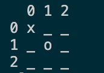

# Zadanie úlohy Piškôrky
Naprogramujte hru piškôrky 3x3 pre dvoch hráčov. Hra pozostáva z maximálne 9tich kôl počas ktorých sa budú hráči striedať raz jeden raz druhý so svojimi ťahmi. 

Počas ťahu hráča x program vyzve hráča aby zadal x-ovú a y-lónovú súradnicu svojho ťahu. Hráč môže vybrať iba pozíciu, ktorá nebola vybratá súperom. 
- Ak hráč zadá už obsadenú pozíciu program ho vyzve aby svoj ťah zopakoval.
- Ak hráč zadá pozíciu mimo poľa program ho vyzve aby svoj ťah zopakoval.

Po každom ťahu hráča prosím vypíšte stav šachovnice, kde znakom "x" označíte ťahy jedného a znakom "o" označíte ťahy druhého hráča. Znakom "_" označíte stále voľné pozície na šachovnici. Príklad:

Na kompletné splnenie úlohy je potrebné:
- Ukončiť hru s nápisom Víťaz je hráč x ak jeho symbol sa zopakova v riadku, stĺpci, alebo diagonále poľa 3 krát za sebou.
- Ukončiť hru s nápis "Remíza" keď na konci všetkých ťahov nie je jasný víťaz.

## Bonus
Skúste ošetriť aj situácie kedy hráč na miesto čísla zadá znak alebo string do poľa pozície. V tomto prípade ho program vyzve aby svoju voľbu pozície zopakoval (stačí len voľba problémového koordinátu). 

Rozdeľte funkcionalitu do modulov, ktoré importujete do hlavného modulu. Dodržte konvencie čitateľného programovania: 
- Na názov súborov použite snake case.
- Použite anglické názvy premenných a funkcii modulov a podobne.
- Na názov priečinku použite snake case.

### Záver 
Nevzdávajte sa. Tento problém odzrkadľuje zložitosť niektorých prblémov reálneho programátorského života. Jasné že nebudete kódiť piškvorky, ale budete nútený premýšľať nad riešením vaších úloh